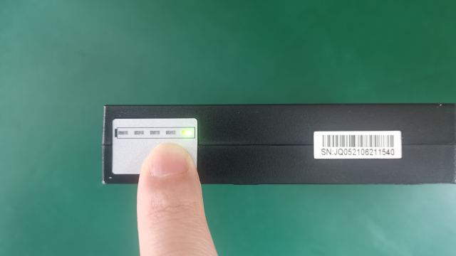
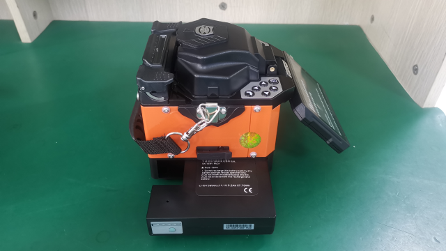
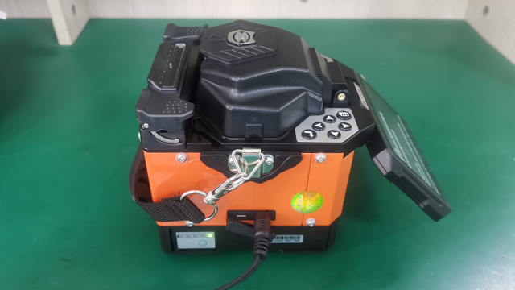

# 电池保养

**简介：**由于锂电池组具有自然放电和过放失效特性，长期闲置会导致电池损坏。若长期存储，每三个月需进行一次养护，将电量充至三格。

步骤：

**1. 外观检查：**检查电池外观是否完整，无破损、鼓胀和漏液情况。

**2. 检查当前电量：**按电量显示按钮查看当前电量。

 **3. 插入电池：**将电池插入熔接机电池仓。

**4. 连接适配器：**将适配器插入熔接机电源口，查看电池电量显示面板，确认电量显示灯开始闪烁，进入充电状态。

**5. 充电至3格：**电池电量指示灯第3个闪烁后停止充电\(电池长期存储或运输应保持中低电量状态\)。

**6. 完成**

[返回开始页](../)

