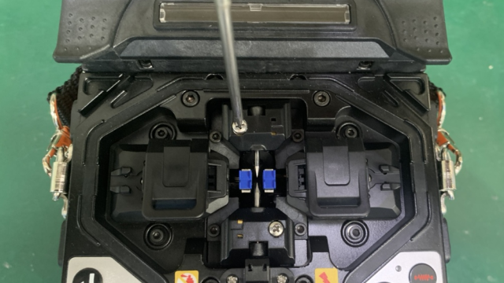
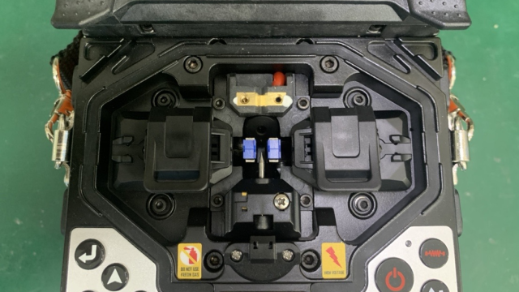
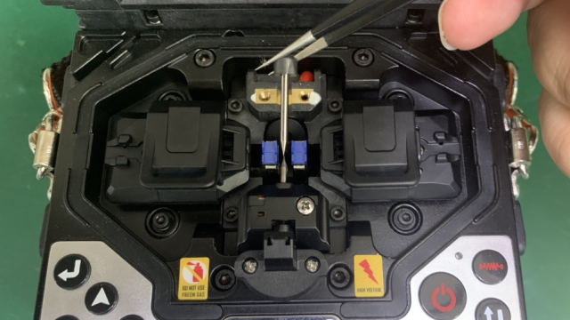
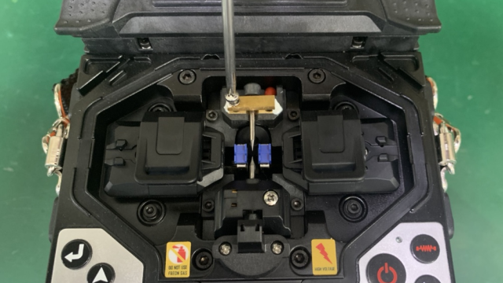
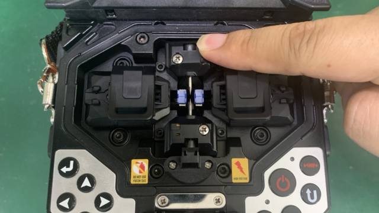

# 更换电极

**简介：**电极使用过程中会逐渐老化，影响熔接质量，使用3000次后应及时更换。

**步骤：**

**1. 拆卸电极罩**

   1.1. 使用十字起\(PH1\)拆卸电极罩螺钉。

   ****1.2. 向上拔出电极罩。

**2. 装入新电极**

**3. 安装电极罩**

 ****  3.1. 安装电极压板\(宽面朝上\)。

   3.2. 压入电极罩。

**4. 重复步骤1~3，更换另一侧电极棒**

**5. 重置电极棒放电计数**

**6. 进行**[**放电测试**](fang-dian-ce-shi.md)\*\*\*\*

**7. 完成**

[返回开始页](../)

