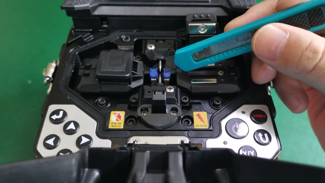

# 设备清洁

**简介：**熔接前进行设备的清洁和保养是保证熔接质量的重要步骤。

**步骤：**

**1. 清洁V槽**

   1.1. 使用美工刀片清理左侧V槽。

   1.2. 使用美工刀片清理右侧V槽。

**2. 清洁切割刀**

   ****2.1. 使用棉签清洁上盖胶垫，擦拭轨迹由上往下。

   2.2. 使用棉签清洁底座胶垫，擦拭轨迹由上往下。

**3. 清洁两侧物镜**

   3.1. 使用蘸酒精棉签\(纯度99%以上\)清洁X物镜，擦拭轨迹由中心螺旋向外。

   3.2. 使用蘸酒精棉签\(纯度99%以上\)清洁Y物镜，擦拭轨迹由中心螺旋向外。

**4. 完成**

\*\*\*\*

[返回开始页](../)

