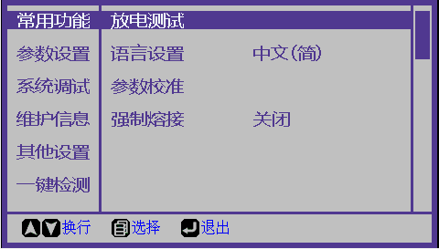
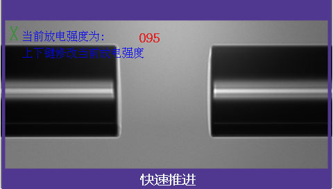
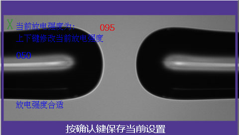

# 放电测试

**简介：**每月进行一次放电测试，可以保证熔接机处于最佳性能状态。

**步骤：** 

**1. 进入菜单**

   1.1. 进入“常用功能”菜单，选择“放电测试”栏。

   1.2. 按“菜单键”进入放电测试程序。屏幕显示“请放光纤，按确认键继续”。

**2. 放电测试**

   2.1. 放入两根切割完成的光纤，关闭防风罩后按”菜单键“。熔接机自动完成光纤推出、对准和放电。

   2.2. 放电后，屏幕上左侧将提示测试值和测试结论。‌

* 若提示“放电强度太弱/太强”，打开防风罩，重复步骤2。

   2.3. 若提示“放电强度合适”按“菜单键”保存参数。

**3. 完成**

[返回开始页](../)

