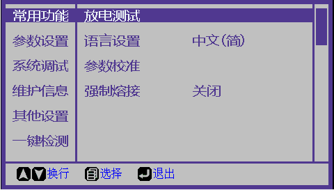

# 常用功能

### 放电测试


为确保稳定的熔接质量，使用者应定期操作。在以下条件下使用熔接机时，应进行放电试验：超高温、超低温、极干燥、极潮湿环境、电极恶化、异类光纤接续、清洁或更换电极后。

放电试验需要使用2根准备接续的光纤，按照一般熔接的方法对光纤剥纤、切断、和放置。按“菜单键”进入放电测试程序。屏幕显示“请放光纤，按确认键继续”，光纤放好后按”菜单键“。

[返回开始页](../)

