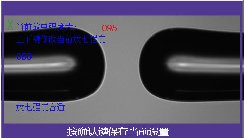

# 常用功能

### 1. 放电测试


**功能简介：**用于根据当前熔接环境、熔接材质和电极状态进行熔接强度校准。

* 为确保稳定的熔接质量，应定期进行放电测试
* 环境温度、湿度或气压发生剧烈变化后应进行放电测试
* 更换电极后应进行放电测试

**测试步骤：** 

\(1\) 按“菜单键”进入放电测试程序。屏幕显示“请放光纤，按确认键继续”。

\(2\) 放入两根切割完成的光纤，关闭防风罩后按”菜单键“。熔接机自动完成光纤推出、对准和放电。

\(3\) 放电后，屏幕上左侧将提示测试值和测试结论。

* 若提示“放电强度太弱/太强”，打开防风罩，重复步骤2。

\(4\) 若提示“放电强度合适”按“菜单键”保存参数，完成测试。

### 2. 语言设置

**功能简介：**用于设置熔接机菜单语言

### 3. 参数校准

**功能简介：**显示熔接参数自检结果，正常值如下：

* 校准值：10
* 基准宽度：155~165
* 自检状态：自检完成

### 4. 强制熔接

**功能简介：**熔接过程中不进行“光纤端面检测”

* 关闭：进行“光纤端面质量检测”（默认状态）
* 开启：不进行“光纤端面质量检测”

[返回开始页](../)

