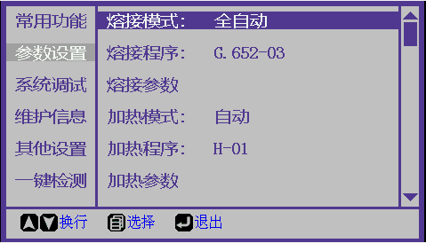

# 参数设置

### 1. 熔接模式

**功能简介：**用于选择熔接模式。

| 熔接模式 | 功能说明              |
| ---- | ----------------- |
| 全自动  | 关闭防风罩后自动开始熔接      |
| 自动   | 关闭防风罩后，按“熔接键”开始熔接 |
| 手动   | 手动操作结构完成推进和对芯操作   |

### 2. 熔接程序

**功能简介：**用于选择不同类型光纤的熔接程序和其它自定义加热程序。

**操作步骤：**[熔接参数设置](rong-jie-can-shu-she-zhi.md)

### 3. 熔接参数

**功能简介：**用于设置当前熔接程序的参数。

**操作步骤：**[熔接参数设置](rong-jie-can-shu-she-zhi.md)

### 4. 加热模式

**功能简介：**用于选择加热模式。

| 加热模式 | 功能说明          |
| ---- | ------------- |
| 自动   | 关闭加热器盖后自动开始热缩 |
| 手动   | 按“加热键”开始热缩    |

### 5. 加热程序

**功能简介：**用于选择自定义加热程序。

**操作步骤：**[加热参数设置](heating-params.md)

### 6. 加热参数

**功能简介：**用于设置当前加热程序的参数。

**操作步骤：**[加热参数设置](heating-params.md)

[返回开始页](../../)
