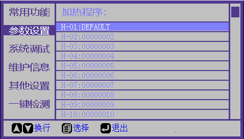

# 加热参数设置

**功能简介:** 用于设置加热器参数

| 参数名 | 说明 | 取值范围 |
| :--- | :--- | :--- |
| 加热时间\(秒\) | 设置加热持续时长 | 10 ~ 90 |
| 持续加热\(4分钟\) | 开启或关闭连续加热4分钟功能 | 打开/关闭 |
| 加热温度 | 设置加热温度 | 100 ~ 250 |
| 校对值 | 温度传感器校正结果 | 0 |
| 传感器校正 | 温度传感器校正值 | 15 |

**设置步骤\(修改当前加热程序参数\)：**

\(1\) 进入“参数设置”菜单。

\(2\) 选择“加热参数”栏，按“菜单键”进入当前加热程序参数设置页面。

\(3\) 根据需要修改”加热时间“或”加热温度“。

**设置步骤\(选择新加热程序并修改参数\):**

\(1\) 进入“参数设置"菜单。

\(2\) 选择“加热模式"栏，按”菜单键“进入加热程序选择页面。

\(3\) 选择希望使用的加热程序栏，按“菜单键”确认选择，所选程序将变为红色。

\(4\) 按“熔接键”进入此加热程序的参数设置页面。

\(5\) 根据需要修改“加热时间”或“加热温度”。

[返回开始页](../../)

