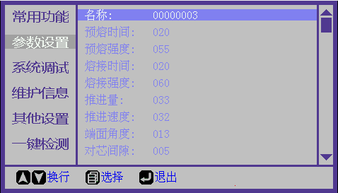
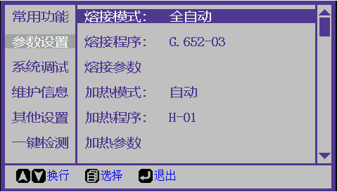
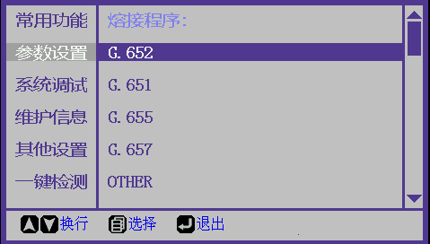
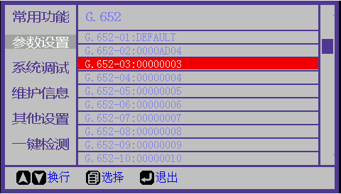

# 熔接参数设置

**功能简介: **用于设置熔接放电参数

**设置步骤(修改当前熔接程序参数)：**

(1) 进入"参数设置"菜单。

(2) 选择"熔接参数“栏，按”菜单键"进入当前熔接程序参数设置页面。

(3) 根据需要修改各项参数(建议使用[放电测试](../../daily-maintenance/fang-dian-ce-shi.md)进行熔接参数校正)。

(4) 完成。

**设置步骤(选择新熔接程序并修改参数):**

(1) 进入“参数设置”菜单。

(2) 选择熔接“熔接程序”栏，按“菜单键”进入熔接程序选择页面。

(3) 根据使用的光纤类型选择对应的熔接程序类别，按“菜单键”进入熔接程序选择子页面。

(4) 选择希望使用的熔接程序栏，按“菜单键”确认选择，所选程序将变成红色。

(5) 按“熔接键"进入此熔接程序的参数设置页面。

(6) 根据需要修改各项参数(建议使用[放电测试](../../daily-maintenance/fang-dian-ce-shi.md)进行熔接参数校正)。

(7) 完成。
