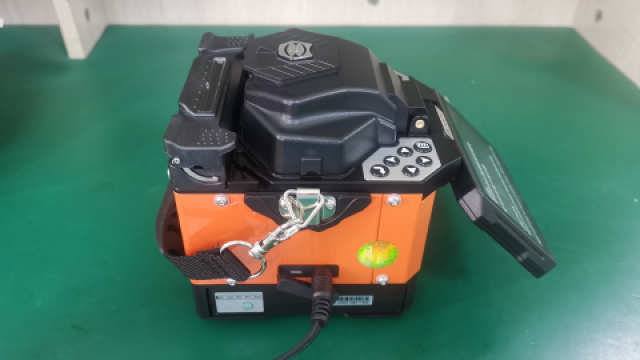
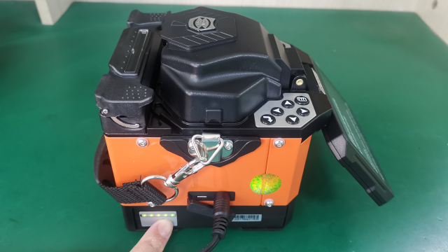

# 电池充电

**简介：**熔接机电池为可充电锂电池，长时间低电量会导致电池损坏，设备启用后请及时进行充电。

**步骤：**

**1. 外观检查：**检查电池外观是否完整，无破损、鼓胀和漏液情况。

**2. 检查当前电量：**按电量显示按钮查看当前电量。

**3. 插入电池：**将电池插入熔接机电池仓。

**4. 连接适配器：**将适配器插入熔接机电源口，查看电池电量显示面板，确认电量显示灯开始闪烁，进入充电状态（注：若电池长时间未使用导致电池过放电，电量显示灯将不闪烁，充电1小时后恢复正常）。

5**. 充电完成：**充电完成时电量显示灯全部亮起，停止闪烁，并于5秒后自动熄灭。

6**. 充电完成确认：**按电量显示按钮，电量显示灯全部亮起。

**7. 完成**

[返回开始页](../)

