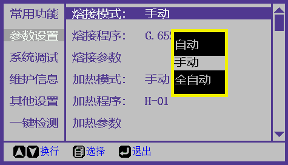

# 光纤位置校正

### \[0\]. 异常现象

   \[0-1\]. 光纤不在中心位置，提示“请重放光纤”。

   \[0-2\]. 光纤不在中心位置，光纤持续上下移动。

   \[0-3\]. 推进时光纤发生对撞。

   \[0-4\]. 两侧V槽不在一条直线上。

### \[1\]. 清洁V槽

   \[1-1\]. 使用美工刀片清理左侧V槽，如图1.1。

   \[1-2\]. 使用美工刀片清理右侧V槽，如图1.2。

### \[2\]. 设置工作模式

   \[2-1\]. 按“菜单键” 进入“参数设置”界面，选择“熔接模式”栏，如图2.1。

   \[2-2\]. 按“菜单键” 将熔接模式修改为“手动”，如图2.2。

   \[2-3\]. 按“退出键” ，回到手动模式工作界面，如图2.3。

### \[3\]. 校正左侧V槽

   \[3-1\]. 左侧V槽放入光纤，并关闭防风罩。光纤端面必须超过电极棒，如图3.1。若Y光纤不在屏幕中央，重复步骤1-1，清洁左侧V槽。

   \[3-2\]. 查看屏幕右侧菜单，按“熔接键”  选择第二行，按“菜单键”  2次，参数切换为“X调芯电机”，如图3.2。

   \[3-3\]. 按住“向上”或“向下”键，直到X左侧光纤移动到X屏中央**（注意：光纤移动速度较慢，按键请保持按压，蜂鸣器会一直响）**，如图3.3。

   \[3-4\]. 左侧光纤重放一次，光纤端面超过电极棒，确认X屏左侧光纤在X屏中央，如图3.3。若左侧光纤不在x屏中央，重复步骤3-3。

### \[4\]. 校正右侧V槽

   \[4-1\]. 右侧V槽放入光纤，并关闭防风罩，光纤端面必须超过电极棒，如图4.1。若X光纤不在屏幕中央，重复步骤1-2，清洁右侧V槽。

   \[4-2\]. 查看屏幕右侧菜单第二行，按“菜单键” 切换到“Y电机”，如图4.2。

   \[4-3\]. 一直按住“向上”或“向下”键，直到Y右侧光纤移动到Y屏中央**（注意：光纤移动速度较慢，按键请保持按压，蜂鸣器会一直响）**，如图4.3。

   \[4-4\]. 右侧光纤重放一次，光纤端面超过电极棒，确认Y屏左侧光纤在Y屏中央，如图4.3。若右侧光纤不在y屏中央，重复步骤3-4。

### \[5\]. 完成

[返回开始页](../)

